# 课程综合评价系统(文末免费领取☟)
> 
#### 介绍
课程综合评价系统(Java_SpringBoot)
有BUG可留言加微

#### 软件架构
Java + SpringBoot + Mybatis + Mysql

#### 项目功能说明

1.  管理员功能
> + 用户管理：账户管理、查看学生、查看老师
> + 课程信息管理：管理班级、管理课程
> + 部门管理：查看部门
> + 评价管理：问题显示、分配课程班级、评价内容管理
2.  学生功能
> + 学生评教：我的课程、我的评教
3.  老师功能
> + 学生评教：查看我的分数、我教的班级

### 部分功能演示

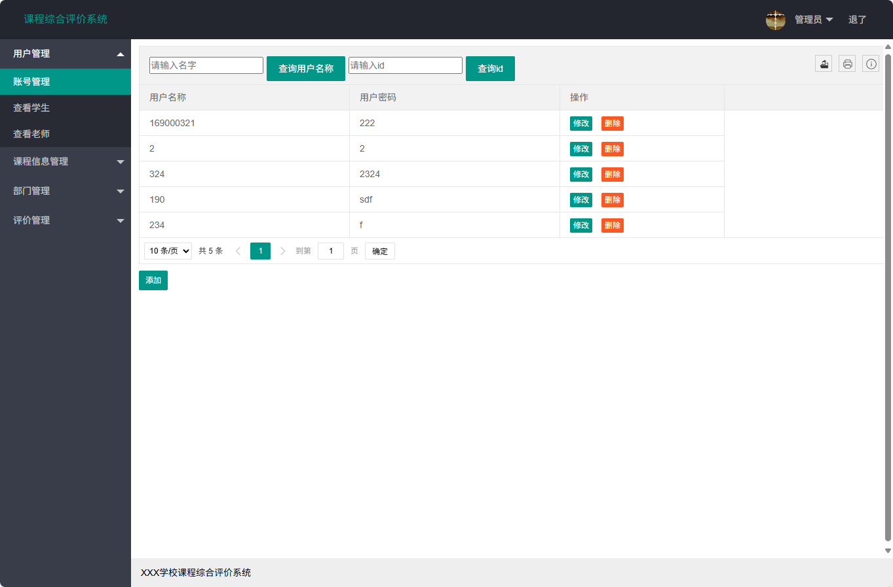
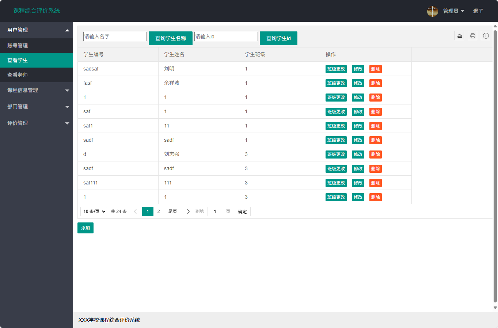
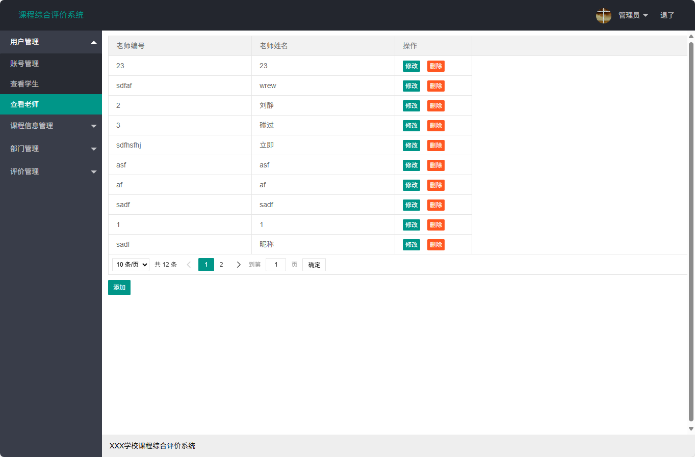
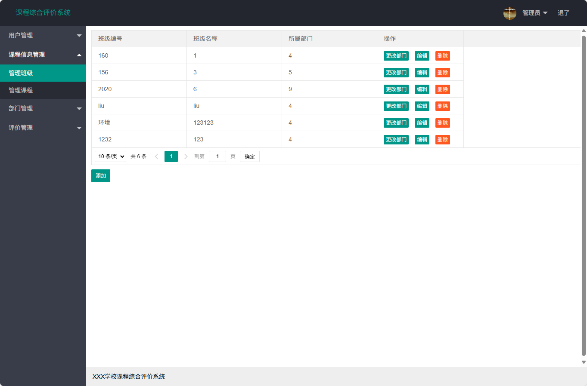
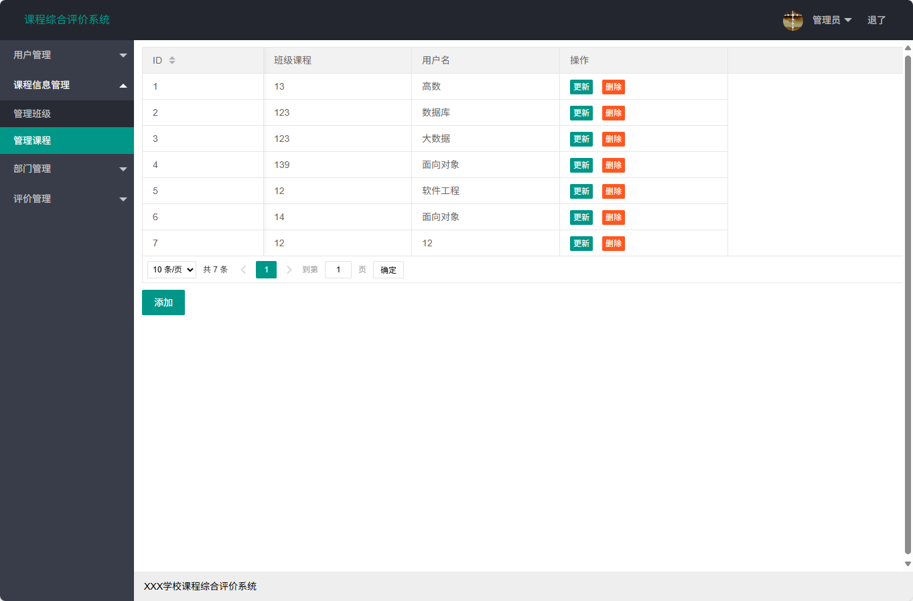
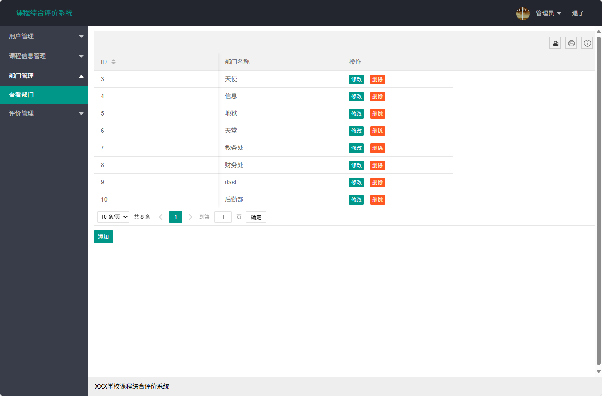
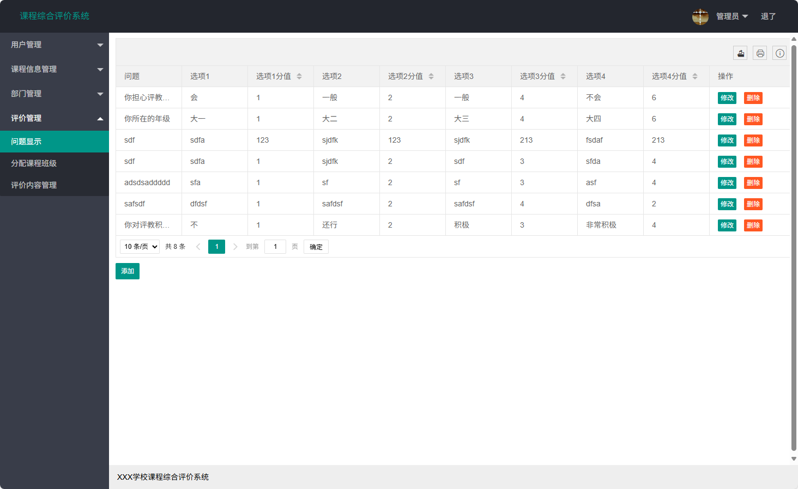
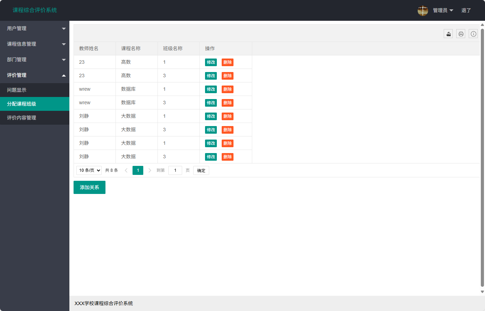
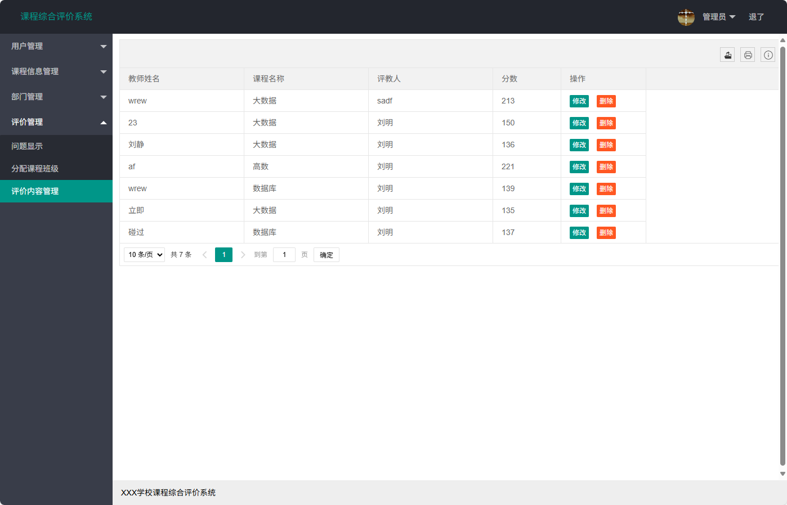
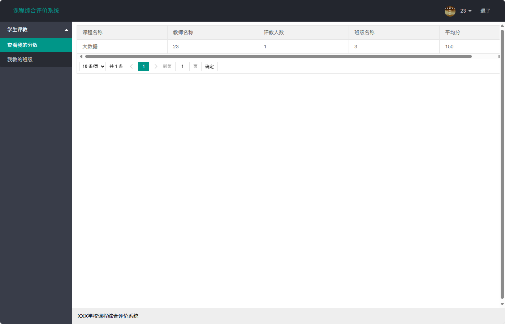
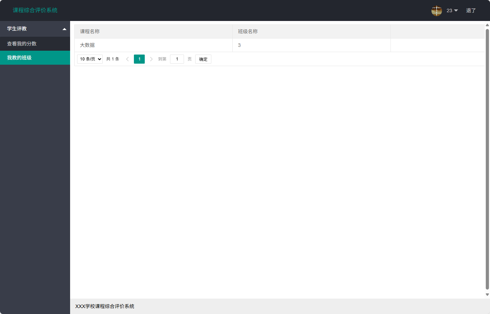
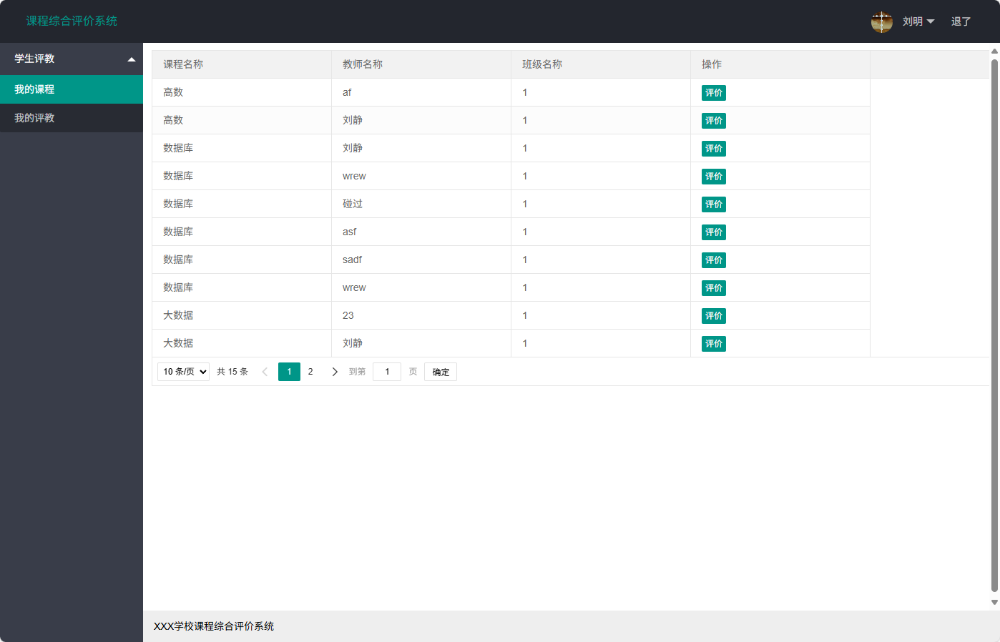
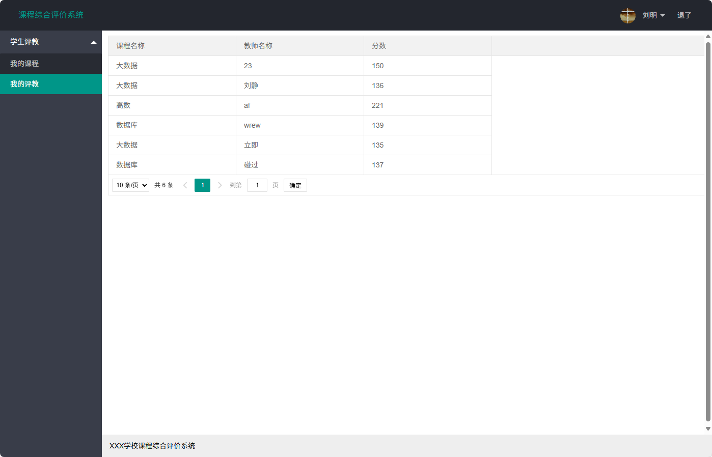

### 环境需求(可免费提供)
- idea/eclipse、jdk-1.8、maven-3.8.6、mysql、node.js等

## 有项目修改、安装调试需求 请联系以下

## 获取资源扫☝☝☝

